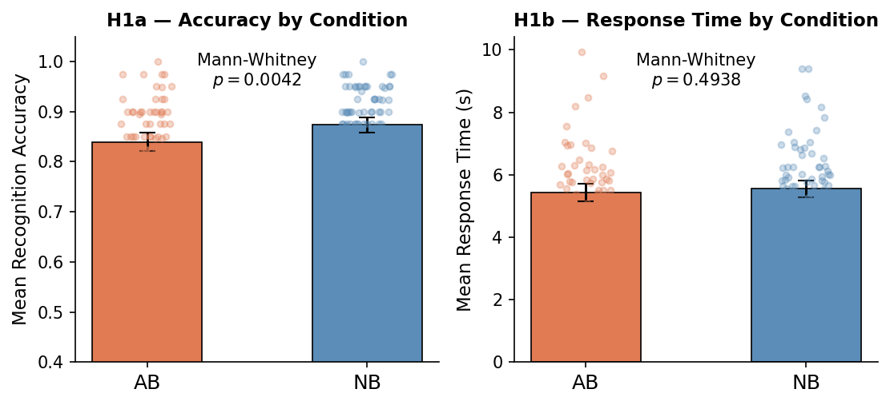
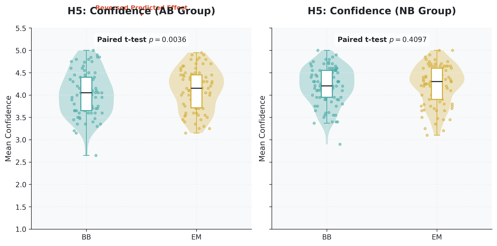
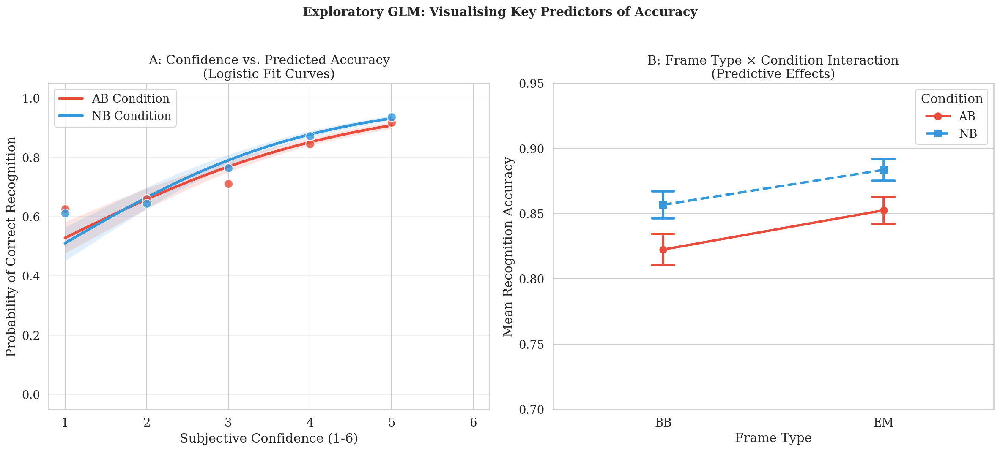

# Movie Memory Experiment
### Report 1: Descriptive and Inferential Statistics
**The Standard Deviants**

---

## 1. Introduction

The dataset was collected to test how disrupting event boundaries affects visual recognition memory. A total of **185 participants** were enrolled in a **between-subjects** experiment comparing two video-editing conditions: **Abrupt Cut (AB)** and **Natural Cut (NB)**. Participants were recruited from a university sample (age range: 19–34 years; M = 22.3, SD = 2.3; 113 male, 50 female). For demographic analyses where data were missing (22 participants), values were **imputed** using the group mean (for age) or group mode (for gender, handedness, and vision). All behavioural data were collected using **PsychoPy 2025.1.1**. Participants completed a two-alternative forced-choice (2AFC) recognition test, identifying target frames (seen) from lure frames (unseen). Targets were drawn from either **before the boundary (BB)** or the **event middle (EM)** frames, allowing us to test whether any memory impairment is specific to boundary-adjacent frames or due to whole event.

---

## 2. Background

Human memory does not encode all moments equally. According to **Event Segmentation Theory** (EST; Zacks et al., 2007), the brain continuously builds a working model of the current situation and generates predictions about what will happen next. When incoming information violates these predictions a **prediction error** is generated, signalling the start of a new event. This triggers a model update that strengthens memory encoding for boundary-adjacent content, while making prior event information temporarily less accessible (Radvansky & Zacks, 2017). The result is the **boundary advantage**: recognition memory is better for frames near event boundaries than for frames from the event middle (Swallow, Zacks, & Abrams, 2009). By artificially cutting a clip before its natural boundary, the AB condition prevents the normal model-update process from completing, which should weaken the boundary-driven encoding boost and reduce memory for the disrupted content.

---

## 3. Dataset Description

A total of **185 participants** were recruited from a university sample and randomly assigned to one of two conditions: **Natural Boundary (NB)** or **Abrupt Boundary (AB)**. All participants reported normal or corrected-to-normal vision and provided informed consent prior to participation. The age range was 19–34 years (*M* = 22.3, *SD* = 2.3; 113 male, 50 female). Twenty-two participants with missing demographic data were **retained** in all analyses (including H6) by imputing missing values with the group mean (age) or mode (categorical factors).

Each participant watched 45 video clips during encoding 40 unique YouTube Shorts and 5 repeated clips serving as **vigilance checks** (spacebar press on recognition). After encoding, participants completed a 2AFC recognition test for each unique clip, choosing between a **target** (seen) and a **lure** frame (unseen). Targets were either **BB** or **EM**. After each decision, participants rated confidence on a 1--5 scale. The measured variables are in Table 1.

**Table 1. Measured Variables**

| Variable   | Type        | Description                                      |
| ---------- | ----------- | ------------------------------------------------ |
| Accuracy   | Binary      | Correctly identified target (1) or incorrect (0) |
| RT         | Cont. (s)   | Time from stimulus display to key press          |
| Confidence | Ordinal     | Self-rated certainty (1 = low, 5 = high)         |
| Frame Type | Categorical | BB (near boundary) or EM (event middle)          |
| Condition  | Categorical | NB (natural boundary) or AB (abrupt boundary)    |
| Enc. Time  | Cont. (min) | Total time spent watching videos during encoding |

---

## 4. Methods

### 4.1 Participant Demographics

A total of **185 participants** were recorded, of whom **171** had usable behavioural data files. Both groups were well-matched on all demographic variables; a breakdown is given in Table 2.

**Table 2. Participant Demographics by Condition**

| Variable | Category | AB ($n=78$) | NB ($n=88$) |
| :--- | :--- | :---: | :---: |
| **Age** | Range (years) | 19–34 | 19–34 |
| | Mean (SD) | 22.1 (1.7) | 22.2 (2.2) |
| **Gender** | Male | 55 | 63 |
| | Female | 23 | 23 |
| **Handedness** | Right-handed | 75 | 81 |
| | Left-handed | 3 | 5 |
| **Vision** | Normal | 45 | 46 |
| | Corrected | 33 | 38 |
| | Uncorrected | 0 | 2 |

*Note: Totals for NB may sum to 86 for some variables due to 2 participants lacking records entirely.*

### 4.2 Data Cleaning

**Incomplete data.** The file for participant sub42 (NB) contained only demographic output with no recognition trial data. Participant sub20 data was unavailable. Both were excluded from all analyses.

**Excessive encoding time.** The five repeated clips account for 5.6 minutes of total encoding time; assuming 25 seconds per repeated-clip recognition, participants spending more than 27.05 minutes in total were deemed inattentive. Four participants exceeded this threshold and were excluded (Table 3).

**Table 3. Participants Excluded for Excessive Encoding Time**

| Participant | Condition | Enc. Time (min) |
| ----------- | --------- | --------------- |
| sub32       | AB        | 27.33           |
| sub36       | AB        | 27.77           |
| sub151      | NB        | 27.16           |
| sub161      | NB        | 28.00           |

**Response time outliers.** Trials with RT < 0.2 s or RT > 60 s were excluded. One outlier was identified: sub28 (AB, Movie 8, RT = 71.09 s).

**Response time cleaning.** In some of the analysis we used the distributions and applied data cleaning. Trials with response times (RT) greater and lesser than $Mean \pm 4 \times SD$ were removed to minimize the impact of inattentiveness. This resulted in the removal of 54 trials (0.8% of total data).

**Condition re-classification.** Participant sub157 was labelled AB in the filename, but the video path column confirmed NB stimuli were viewed. Sub157 was re-classified to NB.

After all exclusions, the **final analysed sample comprised 166 participants** (AB: $n = 78$; NB: $n = 88$).

### 4.3 Hypotheses

Based on Event Segmentation Theory, we came up with six hypotheses.

**H1 — Effect of Condition**
| Property      | Detail                                                                                                                                          |
| ------------- | ----------------------------------------------------------------------------------------------------------------------------------------------- |
| **IV**        | Viewing condition (NB vs. AB) — between subjects                                                                                                |
| **DV**        | Mean recognition accuracy, mean RT (s)                                                                                                          |
| $H_0$         | No difference in accuracy or RT between NB and AB                                                                                               |
| $H_A$         | Participants in the NB condition will show higher overall recognition accuracy and faster response times than participants in the AB condition. |
| **Direction** | One-tailed (NB > AB accuracy; NB < AB RT)                                                                                                       |
| **Test**      | Mann-Whitney U test \& trial-level Regression (for RT)                                                                                          |

**H2 — Effect Larger for BB Frames**
| Property      | Detail                                                                                                                          |
| ------------- | ------------------------------------------------------------------------------------------------------------------------------- |
| **IV**        | Viewing condition (NB vs. AB) — between subjects                                                                                |
| **DV**        | Mean recognition accuracy for BB frames                                                                                         |
| $H_0$         | No difference in BB accuracy between conditions                                                                                 |
| $H_A$         | Recognition accuracy will be greater for before-boundary (BB) frames than for event-middle (EM) frames. Reflecting NB advantage |
| **Direction** | One-tailed (Accuracy : BB > EM)                                                                                                 |
| **Test**      | Independent-samples $t$-test                                                                                                    |

**H3 — No Condition Effect for EM Frames**
| Property      | Detail                                                                                         |
| ------------- | ---------------------------------------------------------------------------------------------- |
| **IV**        | Viewing condition (NB vs. AB) — between subjects                                               |
| **DV**        | Mean recognition accuracy for EM frames                                                        |
| $H_0$         | Recognition accuracy for EM frames will not differ significantly between the NB and AB groups. |
| $H_A$         | Significant difference in EM accuracy                                                          |
| **Direction** | Two-tailed (EM frames are away from the manipulation point)                                    |
| **Test**      | Independent-samples $t$-test                                                                   |

**H4 — Confidence Calibration**
| Property      | Detail                                                                                                                                       |
| ------------- | -------------------------------------------------------------------------------------------------------------------------------------------- |
| **IV**        | Trial outcome (correct / incorrect) — within subjects                                                                                        |
| **DV**        | Mean confidence rating (1--5 scale)                                                                                                          |
| $H_0$         | Confidence equal for correct and incorrect trials within each condition (AB and NB)                                                          |
| $H_A$         | Within each condition (AB and NB), confidence ratings will be higher for correctly recognised trials than for incorrectly recognised trials  |
| **Direction** | One-tailed                                                                                                                                   |
| **Test**      | Shapiro-Wilk (normality) $\rightarrow$ Paired $t$-test (if normal) or Wilcoxon Signed-Rank (if non-normal), applied separately per condition |

**H5 — Confidence by Frame Type**
| Property      | Detail                                                                                                                                     |
| ------------- | ------------------------------------------------------------------------------------------------------------------------------------------ |
| **IV**        | Frame type (BB vs. EM) — within subjects                                                                                                   |
| **DV**        | Mean confidence rating (1--5 scale)                                                                                                        |
| $H_0$         | Confidence equal for BB and EM trials                                                                                                      |
| $H_A$         | Confidence ratings will be higher for BB trials than for EM trials.                                                                        |
| **Direction** | One-tailed                                                                                                                                 |
| **Test**      | Shapiro-Wilk (normality) $\rightarrow$ Paired $t$-test (if normal) or Wilcoxon Signed-Rank (if non-normal), and trial-level OLS Regression |

**H6 — Demographic Balance**
| Property      | Detail                                                                                                                     |
| ------------- | -------------------------------------------------------------------------------------------------------------------------- |
| **IV**        | Viewing condition (NB vs. AB) — between subjects                                                                           |
| **DV**        | Age; gender; handedness; vision status                                                                                     |
| $H_0$         | The NB and AB groups will not differ significantly on age, gender distribution, handedness distribution, or vision status. |
| $H_A$         | Demographic distributions differ significantly                                                                             |
| **Direction** | Two-tailed                                                                                                                 |
| **Test**      | Independent $t$-test (age); $\chi^2$ test (categorical variables)                                                          |

### 4.4 Statistical Analysis

Normality of distributions was verified using the Shapiro-Wilk test before each inferential test. Because the data violated normality for H1 (accuracy and RT), H2 (BB frames), and H3 (EM frames) across both groups, we used the non-parametric **Mann-Whitney U test** in all these cases. For Hypothesis 1, the participant-level comparison was supplemented by a trial-level OLS Linear Regression for RT to evaluate processing speed in greater detail. For H4, where the NB group's difference scores were non-normal ($W = 0.967, p = .025$), the Wilcoxon Signed-Rank test was substituted for the paired $t$-test. For H6 age, the Mann-Whitney U test was similarly applied. In addition to these participant-level tests, we fitted **trial-level Regression models** (OLS for RT and H5) to evaluate predictive effects without losing trial-level variability. The significance threshold was $\alpha = 0.05$ throughout.

---

## 5. Results

### 5.1 H1 --- Main Effect of Condition

**Prediction:** NB participants would show higher accuracy and faster response times than AB participants.

### 5.1.1 Accuracy

**Prediction:**
We expected that participants in the NB condition would have better recognition accuracy than those in the AB condition.

**Descriptive Statistics:**
Participants in the NB group identified targets more accurately (average = 87.4%, SD = 7.0%, median = 87.5%) than participants in the AB group (average = 84.0%, SD = 8.0%, median = 85.0%) showing that NB group performed better overall.

**Assumption Testing:**
Shapiro-Wilk test confirmed that accuracy data for both groups was not normally distributed (AB: W = 0.942, p < .001; NB: W = 0.914, p < .001). So we used  non-parametric test (Mann-Whitney U test) to compare the groups.

**Inferential Statistics:**
The Mann-Whitney U test showed that the difference in accuracy b/w the two groups is statistically significant (U = 2550.5, p = .0042). 

**Conclusion:**
We reject the null hypothesis (p < .05) and accept the alternative hypothesis. Supporting the idea from Event Segmentation Theory that keeping natural event boundaries helps improve visual recognition memory.

**H1a (Accuracy):** Since $p = .0042 < \alpha = .05$, we **reject the null hypothesis** ($H_0$: no difference in accuracy between conditions) and **support the alternative hypothesis** ($H_A$: NB participants show higher recognition accuracy than AB participants).

Contrary to our prediction, both group medians (which provide a good measure alongside means) indicated that NB participants ($Mdn = 5.48$ s, $M = 5.56$ s) were **not** faster than AB participants ($Mdn = 5.30$ s, $M = 5.44$ s) but were slightly slower on average. The difference was not statistically significant ($U = 3220.0, p = .4938$). The trial-level OLS LR confirmed that experimental condition was not a significant predictor of response time ($B = 0.111, p = .144$).

**H1b (Response Time):** Since $p = .4938 > \alpha = .05$, we **fail to reject the null hypothesis**. There is insufficient evidence to support the alternative hypothesis ($H_A$: NB participants respond faster than AB participants).

*Figure 5.1 --- H1: Mean recognition accuracy and mean response time by condition (NB vs. AB).*

### 5.2 H2 --- Recognition Accuracy for Pre-Boundary Frames

**Prediction:** NB participants would show higher accuracy for before-boundary (BB) frames than AB participants.

**Rationale:** The boundary advantage predicts that frames just before a natural boundary benefit from heightened perceptual and attentional processing. In the AB condition, the artificial early cut eliminates this encoding boost for BB frames.

**Normality check.** The Shapiro-Wilk test confirmed that BB-frame accuracy distributions were significantly non-normal in both the AB group ($W = 0.946, p = .002$) and the NB group ($W = 0.925, p < .001$). Consequently, the independent-samples $t$-test was replaced by the **Mann-Whitney U test**.

**Table 5.1. Mean BB-frame recognition accuracy**
| Group | $M$   | $SD$  | $Mdn$ | $n$ |
| ----- | ----- | ----- | ----- | --- |
| AB    | 0.823 | 0.106 | 0.850 | 77  |
| NB    | 0.855 | 0.096 | 0.850 | 87  |

NB participants ($M = 0.855$, $Mdn = 0.850$) achieved significantly higher BB-frame accuracy than AB participants ($M = 0.823$, $Mdn = 0.850$): $U = 2705.5$, $p = .032$, rank-biserial $r = 0.192$. This confirms that the natural encoding boost for boundary-adjacent frames is weakened when the boundary is artificially cut off. A trial-level **Logistic GLM** (accuracy $\sim$ condition, BB trials only) corroborated this: being in the NB condition significantly increased the log-odds of a correct response ($B = 0.241$, $z = 2.526$, $p = .012$, $OR = 1.272$, $VIF_{\text{condition}} = 1.000$).

**H2:** Since $U = 2705.5$ and $p = .032 < \alpha = .05$ (confirmed by GLM $p = .012$), we **reject the null hypothesis** and **support the alternative hypothesis** ($H_A$: NB participants show higher BB-frame accuracy than AB participants). Effect size is small-to-medium (rank-biserial $r = 0.192$).

### 5.3 H3 --- Recognition Accuracy for Event-Middle Frames

**Prediction:** EM frame accuracy would not differ significantly between conditions.

**Rationale:** If the boundary effect only strengthens memory for moments immediately surrounding the boundary, frames from the event middle should be encoded similarly regardless of condition.

**Normality check.** The Shapiro-Wilk test confirmed non-normality for EM-frame accuracy in both the AB group ($W = 0.923, p < .001$) and the NB group ($W = 0.914, p < .001$). Consequently, the **Mann-Whitney U test** was used.

**Table 5.2. Mean EM-frame recognition accuracy**
| Group | $M$   | $SD$  | $Mdn$ | $n$ |
| ----- | ----- | ----- | ----- | --- |
| AB    | 0.852 | 0.093 | 0.850 | 77  |
| NB    | 0.884 | 0.080 | 0.900 | 87  |

Contrary to prediction, NB participants ($M = 0.884$, $Mdn = 0.900$) were also significantly more accurate on EM frames than AB participants ($M = 0.852$, $Mdn = 0.850$): $U = 2648.0$, $p = .019$, rank-biserial $r = 0.209$. A trial-level **Logistic GLM** (accuracy $\sim$ condition, EM trials only) confirmed the condition effect: being in the NB condition significantly increased accuracy log-odds ($B = 0.280$, $z = 2.701$, $p = .007$, $OR = 1.323$, $VIF_{\text{condition}} = 1.000$). The accuracy drop in the AB group was therefore uniform across both BB and EM frames, suggesting that an abrupt cut impairs memory for the entire clip, not only boundary-adjacent content.

**H3:** Since $U = 2648.0$ and $p = .019 < \alpha = .05$ (GLM $p = .007$), we **fail to retain the null hypothesis** ($H_0$: no difference in EM-frame accuracy). Contrary to prediction, the boundary disruption generalises beyond BB frames.

*Figure 5.2 --- H2 \& H3: Mean recognition accuracy by frame type (BB, EM) and condition.*

### 5.4 H4 --- Confidence Calibration

**Prediction:** Within each condition (AB and NB), participants would report higher confidence on correct trials than on incorrect trials.

**Rationale:** If subjective confidence tracks genuine memory signal strength, it should be positively calibrated with accuracy. Analyzing this separately per condition confirms that metacognitive signals are robust regardless of boundary disruption.

One participant who made no errors across the session was excluded from this specific test.

We first evaluated the normality of the differences in confidence ratings using the Shapiro-Wilk test. For the AB group, the distribution was normal ($W = 0.975, p = .134$), leading to a paired $t$-test. For the NB group, the distribution was non-normal ($W = 0.969, p = .033$), requiring the Wilcoxon Signed-Rank test.

**Table 5.3. H4 Results: Confidence Calibration by Condition**
| Group | Correct $M$ | Incorr. $M$ | Test     | Stat         | $p$      | Effect Size |
| ----- | ----------- | ----------- | -------- | ------------ | -------- | ----------- |
| AB    | 4.201       | 3.362       | $t$-test | $t = 12.562$ | $< .001$ | $d = 1.422$ |
| NB    | 4.311       | 3.356       | Wilcoxon | $W = 50.5$   | $< .001$ | $r = 0.971$ |

In both conditions, participants were significantly more confident when correct than when incorrect ($p < .001$), with the effect consistently in the predicted direction (**Correct > Incorrect**). Effect sizes were very large ($d = 1.422, r = 0.971$).

**H4:** Since $p < .001$ for both groups and the direction is correct, we **reject the null hypothesis** and **strongly support the alternative hypothesis**.

*Figure 5.3 --- H4: Mean confidence ratings for correct vs. incorrect trials by condition.*

**Prediction:**
We expected that participants would feel more confident for BB frames than EM frames.

**Data Cleaning:**
Removed trials where the RT was very high greater than M + 4 × SD as explained in 4.2.

**Descriptive Statistics:**
Contrary, participants were not more confident for BB frames.In the AB condition confidence was lower for BB frames (M = 4.03, SD = 0.52) compared to EM frames (M = 4.12, SD = 0.49).In the NB condition, confidence was mostly same for BB frames (M = 4.20, SD = 0.55) and EM frames (M = 4.22, SD = 0.47).

**Assumption Testing:**
Shapiro-Wilk test showed that the differences between BB and EM frames is a normal distribution for both groups (AB: W = 0.978, p = .190; NB: W = 0.982, p = .265). So we used paired t-tests to compare them.

**Inferential Statistics:**
The paired t-test for the AB group showed a significant difference (t(77) = −3.004, p = .0036) but in the opposite direction than expected (EM > BB).For the NB group, the difference was not significant (p = .4097).

Trial-level OLS Regression supported the results showing that in the AB condition, confidence for BB frames was significantly lower (B = −0.091, p = .025). It also showed that overall confidence was higher in the NB group compared to the AB group (B = 0.106, p = .008).

**Conclusion:**
Since confidence for BB frames was either lower or not different  we reject both the null hypothesis (H0) and the alternative hypothesis (HA).Meaning natural event boundaries do not increase confidence and abrupt cuts actually reduce confidence for moments just before the cut.
 leading up to the cut.

*Figure 5.4 --- H5: Mean confidence by frame type (BB vs. EM) and condition.*

### 5.6 H6 --- Demographic Equivalence

We first evaluated the normality of the age distribution using the Shapiro-Wilk test. Age was found to be significantly non-normal in both AB ($W = 0.855, p < .001$) and NB ($W = 0.929, p < .001$) groups. Consequently, an independent-samples Mann-Whitney U test was used for age. Categorical variables were tested using Chi-square tests of independence.

**Table 5.5. Demographic Balance Checks**
| Variable   | AB       | NB       | Test           | Stat                | $p$    |
| ---------- | -------- | -------- | -------------- | ------------------- | ------ |
| Age        | Mdn=22.3 | Mdn=22.0 | Mann-Whitney U | $U = 4391.5$        | $.564$ |
| Gender     | 51M, 27F | 55M, 33F | Chi-square     | $\chi^2(1) = 0.205$ | $.651$ |
| Handedness | 71R, 7L  | 83R, 5L  | Chi-square     | $\chi^2(1) = 0.491$ | $.484$ |
| Vision     | 46N, 32C | 45N, 43C | Chi-square     | $\chi^2(2) = 2.161$ | $.339$ |

There were no significant differences between groups on any demographic factor (all $p > .05$), confirming that random assignment produced balanced experimental groups.

**H6:** Since all $p > .05$, we **fail to reject the null hypothesis** and **support the alternative hypothesis** (groups are balanced).

*Figure 5.5 --- H6: Age and gender distribution by condition.*

**Table 5.6. Participant-level means by condition**
| Variable             | AB ($n = 78$) | NB ($n = 88$) |
| -------------------- | ------------- | ------------- |
| Accuracy ($M$, $SD$) | 0.84 (0.08)   | 0.87 (0.07)   |
| RT in s ($M$, $SD$)  | 5.57 (1.42)   | 5.75 (1.63)   |

---

## 6. Exploratory Analysis: Predicting Recognition Accuracy

While our previous tests looked at factors separately, we used a General Linear Model (Logistic Regression) to assess trials simultaneously ($N = 6,640$). This allowed us to test how confidence, experimental condition, and frame type (BB vs. EM) jointly predict accuracy. 

**Table 6.1. Logistic Regression Results for Recognition Accuracy**
| Predictor       | Coef ($B$) | $z$     | $p$     | Odds Ratio |
| --------------- | ---------- | ------- | ------- | ---------- |
| Intercept       | $-0.692$   | $-5.99$ | $<.001$ | $0.50$     |
| Condition (NB)  | $0.183$    | $2.51$  | $.012$  | $1.20$     |
| Frame Type (EM) | $0.208$    | $2.84$  | $.004$  | $1.23$     |
| Confidence      | $0.589$    | $21.21$ | $<.001$ | $1.80$     |

Confidence was the strongest independent predictor of accuracy; for every 1-point increase in subjective confidence, the odds of a correct answer increased by 80.2% ($OR = 1.80$). Both condition and frame type were also significant predictors, confirming that even when controlling for confidence, the natural-boundary advantage remains. Variance Inflation Factor (VIF) checks confirmed that all predictors were independent ($VIF \approx 1.0$), ensuring the model is stable.

*Figure 6.1: (A) Accuracy predicted by confidence; (B) Effect of video cuts and frame types.*

---

## 7. Summary of Findings

- **Hypothesis 1 (Effect of Condition):** NB participants were significantly more accurate than AB participants ($U=2550.5, p=.0042$), while no significant difference was found in response time ($p=.548$). This confirms that preserving natural boundaries improves memory without incurring a speed-accuracy trade-off.
- **Confidence (H4):** The strongest result --- participants were substantially more confident when correct than incorrect (AB: $d = 1.42$; NB: $r = 0.97$), demonstrating reliable metacognitive sensitivity.
- **Confidence by frame type (H5):** The AB group showed *lower* confidence for BB than EM frames --- the opposite of the prediction. No effect in the NB group.
- **Demographics (H6):** Both groups were perfectly matched on all demographic factors (age, gender, handedness, and vision). No sample imbalances were found.
- **Exploratory Analysis (GLM):** Using a multi-factor model with $VIF \approx 1.0$, we found that confidence, condition, and frame type are all independent, significant drivers of recognition accuracy. Confidence is the most powerful predictor, yielding an 80.2% increase in the odds of accuracy per point.

---

## 8. References

Cutting, J. E., Brunick, K. L., & Candan, A. (2012). Perceiving event boundaries in motion pictures. *Psychology of Aesthetics, Creativity, and the Arts*, *6*(4), 323--330.

Radvansky, G. A., & Zacks, J. M. (2017). Event cognition. *Psychological Science in the Public Interest*, *18*(1), 1--57.

Swallow, K. M., Zacks, J. M., & Abrams, R. A. (2009). Event boundaries in perception affect memory encoding and updating. *Journal of Experimental Psychology: General*, *138*(2), 223--244.

Zacks, J. M., Speer, N. K., Swallow, K. M., Braver, T. S., & Reynolds, J. R. (2007). Event perception: A mind-brain perspective. *Psychological Bulletin*, *133*(2), 273--293.

---

## 9. Contributions

- **Akash** --- Data cleaning, Analysis for H1 and H5, report writing.
- **Varun** --- Analysis for H4 and H6, Exploratory Analysis, report writing.
- **Nikhilesh** --- Analysis for H2 and H3, report writing.

**Code Repository:** [https://github.com/Varun2345/BRSM-Project](https://github.com/Varun2345/BRSM-Project)