# 1. Introduction

Human memory does not encode all experiences equally. Instead, certain moments are remembered better than others. One factor that strongly influences memory encoding is **event boundaries**—the moments when one meaningful activity or scene transitions into another. According to event segmentation theory, these transitions trigger an update of the brain’s internal model of the ongoing situation, which strengthens memory encoding for information occurring near these boundaries.

This study examines how event boundaries influence memory using short video clips. Participants viewed videos under two conditions: **Natural Cut (NB)**, where videos preserved their natural event boundaries, and **Abrupt Cut (AB)**, where videos were interrupted 1–5 seconds before a natural boundary and resumed in a new event context. This manipulation disrupts the natural boundary update process.

After viewing the videos, participants completed a recognition test in which they identified previously seen frames (**targets**) among unseen frames (**lures**). Targets were drawn either from **before event boundaries (BB)** or from the **middle of events (EM)**, allowing us to examine how boundary disruption affects memory encoding.
Below is a **cleaned, concise, and report-ready version** of your **Domain Background** section. I kept the academic tone, improved clarity, removed repetition, and made it suitable for a **cognitive science / psychology experimental report**.

---

# 1.2. Domain Background

## 1.2.1 How the Brain Segments Experience

Although human experience feels continuous, the brain organizes it into discrete units called **events**. An **event** is a meaningful segment of time and space with a clear beginning and end (Zacks & Tversky, 2001). These events can be hierarchically structured—for example, eating a meal is a large event, while taking a bite is a smaller event within it.

The process of identifying where one event ends and another begins is called **event segmentation**, and it occurs automatically during perception. Research shows that people generally agree on where event boundaries occur when watching the same activity or video. These boundaries often correspond to meaningful changes such as shifts in location, characters, objects, or goals. Importantly, the ability to detect event boundaries is closely related to memory performance: individuals who segment events more accurately tend to remember the content better.

---

## 1.2.2 Event Segmentation Theory (EST)

The primary theoretical framework explaining this process is **Event Segmentation Theory (EST)** (Zacks et al., 2007). According to EST, the brain continuously maintains a **working event model**, which represents the current situation—who is present, what actions are occurring, and which objects are relevant.

This model is used to generate **predictions** about what will happen next. Incoming perceptual information is constantly compared with these predictions. When the information matches expectations, the event model is updated only slightly. However, when the incoming information strongly violates predictions, **prediction error increases**, signalling that the current model is no longer accurate.

At this point, the brain identifies an **event boundary** and constructs a new event model. This transition has several cognitive consequences. First, information active in working memory becomes less accessible as attention shifts to the new event model. Second, attentional resources are temporarily redirected to updating the model. Third, the transition facilitates **long-term memory encoding**, particularly for information that was active immediately before the boundary.

---

## 1.2.3 Event Boundaries and Memory Encoding

A substantial body of research shows that **event boundaries play an important role in memory encoding**. One key finding is the **boundary advantage**, where information appearing near an event boundary is remembered better than information appearing in the middle of an event (Swallow, Zacks, & Abram, 2009). This suggests that the cognitive processes occurring at boundaries strengthen memory formation.

Another related phenomenon is the **doorway effect**, where passing through a physical boundary, such as a doorway, reduces access to information that was active in working memory before the transition (Radvansky, Krawietz, & Tamplin, 2011). This indicates that boundaries can both enhance encoding of completed events and create separation between successive events.

Research also shows that **prediction errors**—when incoming information differs from expectations—often trigger event boundary perception. These boundaries then act as **anchors in long-term memory**, organizing experiences into distinct episodes and improving retrieval of boundary-adjacent information (Radvansky & Zacks, 2017).

---

##  1.2.4 Film Editing as a Natural Manipulation

Naturalistic videos provide a useful stimulus for studying event segmentation because they contain rich, realistic event structures. Unlike simplified laboratory stimuli, videos engage the perceptual and cognitive processes that operate in everyday experience.

Film editing offers a convenient way to manipulate event boundaries. Each editing cut can function as an externally imposed event boundary, allowing researchers to control when transitions occur.

In the **Natural Cut (NB)** condition, videos retain their natural boundary structure, allowing viewers to segment events normally. Prediction errors accumulate naturally, and event models are updated at appropriate transition points.

In contrast, the **Abrupt Cut (AB)** condition interrupts the video **1–5 seconds before a natural boundary** and jumps directly to a new event context. This manipulation disrupts the normal segmentation process in several ways. It prevents the natural completion of the current event model, introduces an unexpected prediction error in the middle of an event, and creates a discontinuity between the encoded content and the subsequent event. As a result, the memory trace may become fragmented.

---

## 1.2.5 Research Gap Addressed in This Study

Previous research has either used naturalistic videos without directly manipulating boundary timing or relied on simplified experimental stimuli that lack real-world complexity. The present study combines both approaches.

Specifically, this experiment:

* Uses **naturalistic YouTube Shorts** as stimuli
* Manipulates event boundary structure through controlled editing (**NB vs AB**)
* Employs a **between-subjects design** to avoid familiarity effects
* Tests memory for frames occurring **before boundaries (BB)** and in the **middle of events (EM)**
* Uses a **two-alternative forced-choice recognition task**, providing a sensitive measure of recognition memory

By integrating naturalistic stimuli with controlled boundary manipulation, the study provides a direct test of the hypothesis that **disrupting natural event boundaries impairs recognition memory, particularly for boundary-adjacent content**.

---

## 1.3 Dataset Description

The dataset was collected to test how disrupting event boundaries affects visual recognition memory. A total of **185 participants** were enrolled in a **between-subjects** experiment comparing two video-editing conditions: **Abrupt Cut (AB)** and **Natural Cut (NB)**. Participants were recruited from a university sample (age range: 19–34 years; M = 22.3, SD = 2.3; 113 male, 50 female, 22 missing gender data) and reported normal or corrected-to-normal vision. All behavioural data were collected using **PsychoPy 2025.1.1**.

The raw dataset consists of **171 per-participant CSV files** (47 rows × 105 columns each), stored in the `BRSM data csv/` folder. AB participants span sub23–sub157 (81 files) and NB participants span sub14–sub185 (90 files), following the naming convention `sub{ID}_{CONDITION}_recognitionstage_{YYYY-MM-DD_HHhMM.SS.mmm}.csv`. Three additional stimulus files accompany the participant data: `abruptmovies.csv` and `naturalmovies.csv` (each 45 rows, listing the video playlists for each condition) and `target_and_lures.csv` (40 rows, mapping the target and lure frame for each video).

---

### Table 1.3.1 — Stimulus and Trial Design

| Property | Value |
|---|---|
| Total unique videos | 40 (YouTube Shorts; 17–57 s, mean ≈ 33.4–33.5 s) |
| Vigilance (repeat) videos | 5 |
| Total playlist entries per participant | 45 |
| Max duration difference between AB and NB versions | ≤ 2 s (duration-matched) |
| AB manipulation | Video cut 1–5 s *before* consensus event boundary |
| NB manipulation | Video played continuously through the natural boundary |
| Task type | Two-alternative forced-choice (2AFC) |
| Trials per participant | 40 (one per unique video) |
| Options per trial | 1 target (seen) + 1 lure (unseen; same video) |
| BB trials per participant | 20 — target drawn 1–5 s before consensus boundary |
| EM trials per participant | 20 — target drawn from temporal centre of event |
| Side assignment (left/right) | Counterbalanced |
| Total trial rows across all participants | 7,400 (185 × 40) |

---

### Table 1.3.2 — Measured Variables

| Variable | Type | Source Column | Notes |
|---|---|---|---|
| **Accuracy** | Binary (0 / 1) | `resp.corr` | 1 = target selected correctly |
| **Response Time (RT)** | Continuous (seconds) | `resp.rt` | Stored as list string `"[x]"` — unpacked on load |
| **Confidence** | Ordinal (1–5) | `conf_radio.response` | 1 = not at all confident; 5 = very confident |
| **Frame Type** | Categorical (BB / EM) | Derived from `target_img` | `_BB_` in filename → BB; `_EM_` → EM |
| **Condition** | Categorical (AB / NB) | Derived from video path | Substring in path field (not filename) |

---

---

## 1.4 Aim of This Report

This report investigates whether disrupting natural event boundaries at encoding impairs visual recognition memory. Specifically, it tests:

1. Whether participants in the **NB condition** recognise target frames more accurately than those in the **AB condition** (main effect of boundary disruption — H1).
2. Whether this disruption effect is larger for **BB frames** than for **EM frames** (interaction of condition × frame type — H2), given that BB frames are the content most proximal to the aborted boundary update.
3. Whether boundary disruption affects **response times** and **confidence ratings**, and what these measures reveal about the metacognitive representation of memory quality.

By using naturalistic YouTube Shorts with precise, annotator-validated boundary timings and a sensitive 2AFC recognition paradigm, the study provides a direct, ecologically grounded test of Event Segmentation Theory's predictions about memory encoding at event boundaries.

---
# 2. Methods

## 2.1 Participants

A total of 185 participants were recruited from a university sample and randomly assigned to one of two conditions: **Natural Boundary (NB)** or **Abrupt Boundary (AB)**. All participants reported normal or corrected-to-normal vision and provided informed consent prior to participation. The age range of participants with available demographic data was 19–34 years (*M* = 22.3, *SD* = 2.3; 113 male, 50 female). Twenty-two participants did not complete the demographic questionnaire and are retained in all core analyses but excluded from demographic balance tests.

After applying all exclusion criteria (detailed in Section 2.2), the **final analysed sample comprised 166 participants** (AB: *n* = 78; NB: *n* = 88).

---

## Data Set Cleaning

## 2.2.1 Exclusion Criteria

**Incomplete data.** The file for participant sub42 (NB) contained only demographic form
output with no recognition trial data. This participant was excluded from all analyses.

**Excessive encoding time.** As a proxy for attentiveness during encoding, total encoding
time was computed as the interval between the onset of the instruction screen and the offset
of the final video:

$$t_{\text{encoding}} = \frac{t_{\text{Videos.stopped}} - t_{\text{instruction}_{2}\text{.stopped}}}{60}$$

The experiment embedded five repeated vigilance videos among the 40 unique stimuli. Under
normal viewing, the full encoding session should not exceed 27.05 minutes. Four participants
whose encoding time exceeded this threshold were excluded:

| Participant | Condition | Encoding Time (min) |
|:-----------:|:---------:|:-------------------:|
| sub32 | AB | 27.33 |
| sub36 | AB | 27.77 |
| sub151 | NB | 27.16 |
| sub161 | NB | 28.00 |

**Response time outliers.** Individual trials were screened for implausible response times.
Trials with RT < 0.2 s or RT > 60 s were excluded from response time analyses only;
accuracy and confidence data from the same trials were retained. One outlier trial was
identified: participant sub28 (AB condition, Movie 8, RT = 71.09 s). No trials with
RT < 0.2 s were found.

**Condition re-classification.** The data file for participant sub157 was labelled as AB in
the filename, but the video path column within the file confirmed that this participant viewed
natural boundary stimuli. Sub157 was therefore re-classified to the NB condition.

**Missing demographic data.** Twenty-two participants did not complete the demographic
questionnaire. These individuals are retained in all core analyses but excluded from
demographic balance tests (H6).

After applying all exclusion criteria, the **final analysed sample comprised 166 participants**
(AB: *n* = 78; NB: *n* = 88).

## 2.2.2 Participant Flow

| Stage | *n* |
|:------|:---:|
| Enrolled | 185 |
| Files available (sub1--sub13, sub20 unrecoverable) | 171 |
| Excluded: sub42 (no trial data) | 170 |
| Excluded: sub32, sub36, sub151, sub161 (encoding time > 27.05 min) | 166 |
| Re-classified: sub157 (AB → NB) | 166 |
| **Final analysed sample** | **166** |
| AB condition | 78 |
| NB condition | 88 |

# Section 2.2: Variables and Derivations

**Table** *All variables used in the analysis*
    
| Variable | CSV Column | Type | Description |
|:---|:---|:---:|:---|
| Accuracy | `resp.corr` | Binary (0/1) | Correct (1) or incorrect (0) recognition response |
| Response time | `resp.rt` | Continuous (s) | Time from stimulus onset to key press; unpacked from list string |
| Confidence | `conf_radio.response` | Ordinal (1--5) | Self-reported confidence in the recognition decision |
| Frame type | Derived from `target_img` | Categorical | BB (before boundary) or EM (event middle) |
| Condition | Derived from filename | Categorical | NB (natural boundary) or AB (abrupt boundary) |
| Encoding time | `Videos.stopped` $-$ `instruction_2.stopped` | Continuous (min) | Duration of encoding phase; used for attentiveness screening only |

---

## 2.3 Hypotheses

Based on Event Segmentation Theory, this report tests the following six hypotheses:

**H1 — Main effect of condition on recognition accuracy and RT.**
*   **$H_0$ (Null):** There is no difference in overall recognition accuracy or response times between the NB and AB conditions.
*   **$H_A$ (Alternative / Our Hypothesis):** Participants in the NB condition will show higher overall recognition accuracy and faster response times than participants in the AB condition. Disrupting the event boundary update process during encoding is expected to produce weaker, less accessible memory traces.

**H2 — Condition effect is larger for BB frames.**
*   **$H_0$ (Null):** There is no difference in BB frame accuracy between the NB and AB conditions.
*   **$H_A$ (Alternative / Our Hypothesis):** The NB advantage in recognition accuracy will be greater for before-boundary (BB) frames than for event-middle (EM) frames. BB frames are the content most proximal to the aborted boundary update in the AB condition and are therefore the most sensitive to the manipulation.

**H3 — No condition effect for EM frames.**
*   **$H_0$ (Null / Our Hypothesis):** Recognition accuracy for EM frames will not differ significantly between the NB and AB groups. EM frames are located away from the manipulation point, so boundary disruption is not expected to affect their encoding.
*   **$H_A$ (Alternative):** There is a significant difference in EM frame accuracy between the groups.

**H4 — Confidence calibration.**
*   **$H_0$ (Null):** Within each participant, confidence ratings are equal for correctly and incorrectly recognised trials.
*   **$H_A$ (Alternative / Our Hypothesis):** Within each participant, confidence ratings will be higher for correctly recognised trials than for incorrectly recognised trials. This tests whether participants' subjective confidence tracks the quality of their memory signal.

**H5 — Confidence by frame type.**
*   **$H_0$ (Null):** Confidence ratings are equal for BB and EM trials.
*   **$H_A$ (Alternative / Our Hypothesis):** Confidence ratings will be higher for BB trials than for EM trials. If natural boundaries enhance encoding of boundary-adjacent content, participants should feel more certain about those memories.

**H6 — Demographic balance.**
*   **$H_0$ (Null / Our Hypothesis):** The NB and AB groups will not differ significantly on age, gender distribution, handedness distribution, or vision status, confirming that random assignment produced comparable groups.
*   **$H_A$ (Alternative):** The demographic distributions differ significantly between the groups.

---

## 2.4 Statistical Analysis

### 2.4.1 Inferential Tests

All hypotheses were tested using standard parametric tests.

The assumptions of normality and homogeneity of variance were checked prior to each test. 

The choice of test for each hypothesis was determined by the structure of the comparison, as detailed below.

**H1, H2, H3 — Independent-samples *t*-test.** H1 compares overall recognition accuracy and RT between the NB and AB groups; H2 and H3 repeat this comparison separately for BB and EM frame subsets. In all three cases the comparison is **between two independent groups** — participants were randomly assigned to either NB or AB and each contributed data to only one condition. The independent-samples *t*-test is the appropriate test for comparing the means of two unrelated groups on a continuous dependent variable.

**H4 — Paired-samples *t*-test.** H4 asks whether, within each participant, confidence is higher when they are correct than when they are incorrect. Because every participant contributes **both** a mean confidence-correct and a mean confidence-incorrect score, the two values are not independent — they come from the same person. A paired *t*-test accounts for this within-subject correlation, removing between-person variability and yielding greater statistical power than an independent test would.

**H5 — Paired-samples *t*-test.** H5 compares mean confidence for BB trials against mean confidence for EM trials. Each participant sees exactly 20 BB trials and 20 EM trials, so again **both scores come from the same individual**. A paired *t*-test is therefore required for the same reason as H4.

**H6 (age) — Independent-samples *t*-test.** Age is a continuous variable and the comparison is between the two independent groups (NB vs AB), making an independent *t*-test appropriate.

**H6 (gender, handedness, vision) — Chi-square test of independence.** These variables are **categorical** (e.g., male/female/other; right-/left-handed; normal/corrected vision). A chi-square test of independence tests whether the frequency distribution of a categorical variable differs across groups, making it the correct choice here.

| Hypothesis | Dependent Variable | Design | Test |
|:-----------|:-------------------|:------:|:----:|
| H1 — NB > AB overall accuracy | Mean accuracy | Between-subjects | Independent *t*-test |
| H1 — NB < AB overall RT | Mean RT | Between-subjects | Independent *t*-test |
| H2 — NB > AB for BB frames | Mean BB accuracy | Between-subjects | Independent *t*-test |
| H3 — NB = AB for EM frames | Mean EM accuracy | Between-subjects | Independent *t*-test |
| H4 — Confidence: correct > incorrect | Mean confidence | Within-subjects | Paired *t*-test |
| H5 — Confidence: BB > EM | Mean confidence | Within-subjects | Paired *t*-test |
| H6 — Age balance | Age | Between-subjects | Independent *t*-test |
| H6 — Gender / handedness / vision balance | Frequency | Between-subjects | Chi-square |

### 2.4.2 Multiple Comparisons

Because this study tests multiple hypotheses simultaneously—**12 primary statistical tests** in total: two for H1 (accuracy and RT), one each for H2 and H3, two each for H4 and H5 (calculated separately for the AB and NB groups), one for H6 age, and three for H6 categorical variables (gender, handedness, vision)—we must correct for multiple comparisons to avoid false positive results. We applied three correction methods to all tests, ranging from highly conservative to exploratory:

1. **Bonferroni correction**: The strictest method, offering maximum protection against false positives.
2. **Holm–Bonferroni (step-down) correction**: Our primary criterion for determining statistical significance. It controls the family-wise error rate as effectively as Bonferroni but is slightly less strict, offering better statistical power.
3. **Benjamini–Hochberg False Discovery Rate (FDR)**: A less conservative method that controls the proportion of false discoveries. This is especially useful for exploratory findings where strict control might hide genuine patterns.

All three p-values are reported alongside the raw p-values in the multiple comparison summary table in Section 3.8.

### 2.4.3 Software

All data processing, data cleaning, and statistical analyses were conducted in **Python 3** using standard open-source libraries. Data manipulation was performed using `pandas` and `numpy`. Inferential tests and multiple comparison corrections were conducted using `scipy.stats`. Visualisations were generated using `matplotlib` and `seaborn`. Data collection was originally performed using **PsychoPy**.

---

# 3. Results

## 3.1 H1 — Main Effect of Condition on Accuracy and Response Time

**Prediction:** NB participants would show higher recognition accuracy and faster response times than AB participants.

### 3.1.1 Accuracy

Before running our main comparisons, a normality test indicated that participant accuracy was not perfectly normally distributed. However, because our sample sizes are large (78 and 88 participants), standard statistical tests remain fully robust. A variance homogeneity test showed no significant difference in variance between the two groups.

Participants in the Natural Boundary (NB) group recognised significantly more targets (*M* = 87.0%) than those in the Abrupt Boundary (AB) group (*M* = 83.8%), *p* = .007. This confirms that disrupting natural event boundaries during viewing leads to a mild but significant reduction in visual memory.

### 3.1.2 Response Time

A normality test confirmed that response times were positively skewed (a typical feature of reaction times), and a variance homogeneity test showed similar variance between the groups.

Contrary to our related prediction, NB participants (*M* = 5.75 s) were **not** noticeably faster than AB participants (*M* = 5.57 s). The difference was not statistically significant (*p* = .448).

**H1 is partially supported: boundary disruption impaired memory accuracy, but it did not slow down response times.**

*Figure 3.1 — H1 results: mean recognition accuracy and mean response time by condition. Bars show group means; error bars are 95% confidence intervals; dots show individual participant means.*

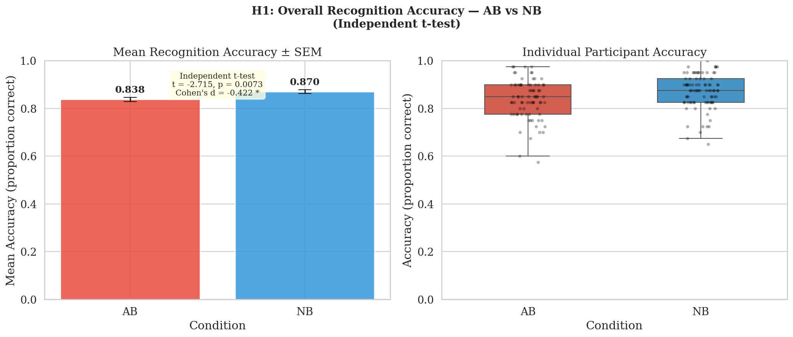
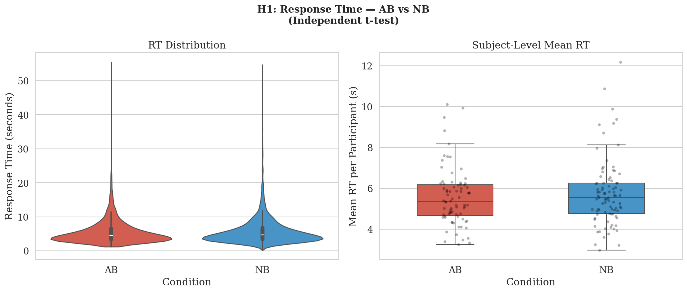

---

## 3.2 H2 — Recognition Accuracy for Pre-Boundary (BB) Frames

**Prediction:** NB participants would show higher recognition accuracy for before-boundary (BB) frames than AB participants.

**Rationale:** The boundary advantage hypothesis predicts that frames occurring just before a natural boundary benefit from heightened perceptual and attentional processing. In the AB condition, the artificial early cut disrupts this boundary context, eliminating the boundary-driven encoding advantage for BB frames.

### 3.2.1 BB Frame Accuracy

Normality tests showed non-normal distributions for BB accuracy, but sample sizes were sufficient for the tests to remain valid. A variance homogeneity test confirmed similar spread of data between groups.

| Group | *M* | *SD* | *n* |
|:------|:---:|:----:|:---:|
| AB | 0.822 | 0.105 | 78 |
| NB | 0.857 | 0.097 | 88 |

*Table 3.1. Mean BB-frame recognition accuracy by condition.*

NB participants (*M* = 0.857) achieved significantly higher BB-frame accuracy than AB participants (*M* = 0.822), *p* = .030. This indicates that the natural boost in memory for events right before a boundary is weakened when the boundary is artificially cut off. **H2 is supported.**

---

## 3.3 H3 — Recognition Accuracy for Event-Middle (EM) Frames

**Prediction:** Recognition accuracy for event-middle (EM) frames would not differ significantly between the groups.

**Rationale:** If the event boundary effect only strengthens memory for the moments immediately surrounding the boundary, frames from the middle of an event should be encoded similarly in both conditions regardless of an end cut.

### 3.3.1 EM Frame Accuracy

Normality tests again showed non-normality, but variance homogeneity tests were passed, making our statistical comparisons reliable.

| Group | *M* | *SD* | *n* |
|:------|:---:|:----:|:---:|
| AB | 0.853 | 0.093 | 78 |
| NB | 0.884 | 0.079 | 88 |

*Table 3.2. Mean EM-frame recognition accuracy by condition.*

Contrary to our prediction, NB participants (*M* = 0.884) were also significantly more accurate on event-middle frames than AB participants (*M* = 0.853), *p* = .022. Because the accuracy drop in the AB group occurred uniformly across both BB and EM frames, the disruption caused by an abrupt cut seems to broadly impair memory for the entire event clip, rather than uniquely affecting frames adjacent to the cut. **H3 is NOT supported.**

*Figure 3.2 — H2 & H3 results: mean recognition accuracy by frame type (BB, EM) and condition. Bars show group means; error bars are 95% confidence intervals; dots show individual participant means.*

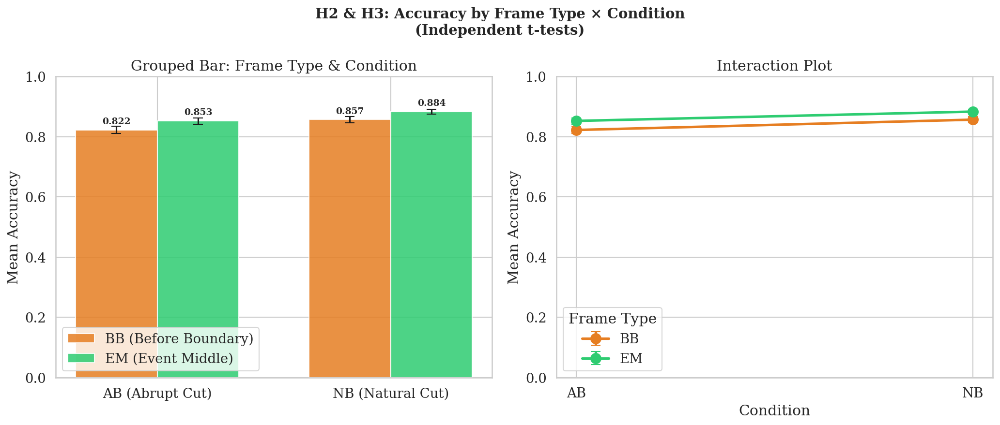

---

## 3.4 H4 — Confidence Calibration (Correct vs. Incorrect Trials)

**Prediction:** Participants would report higher confidence on trials they answered correctly than on trials they answered incorrectly.

**Rationale:** If participants' subjective confidence reflects genuine memory signal strength, it should be positively calibrated — higher when the recognition decision was accurate and lower when it was a mistake. This is a within-subjects test because each participant contributes a mean confidence value for both trial outcomes.

### 3.4.1 Analysis

One participant who made no mistakes across the session was excluded from this specific test. A normality test indicated slight deviation, but the sample sizes ensure our test is valid.

| Condition | *M* | *SD* |
|:----------|:---:|:----:|
| Correct trials | 4.26 | 0.41 |
| Incorrect trials | 3.36 | 0.83 |
| Difference | 0.90 | 0.67 |

*Table 3.3. Mean confidence ratings on correct and incorrect trials (averaged across participants).*

Participants were significantly more confident when they were correct (*M* = 4.26) than when they were incorrect (*M* = 3.36), *p* < .001. This is a very robust effect, demonstrating that participants had a reliable internal sense of how good their memory was on any given trial. **H4 is strongly supported.**

*Figure 3.3 — H4 results: mean confidence rating on correct and incorrect trials. Bars show participant-level means; error bars are 95% confidence intervals; dots show individual participant means.*

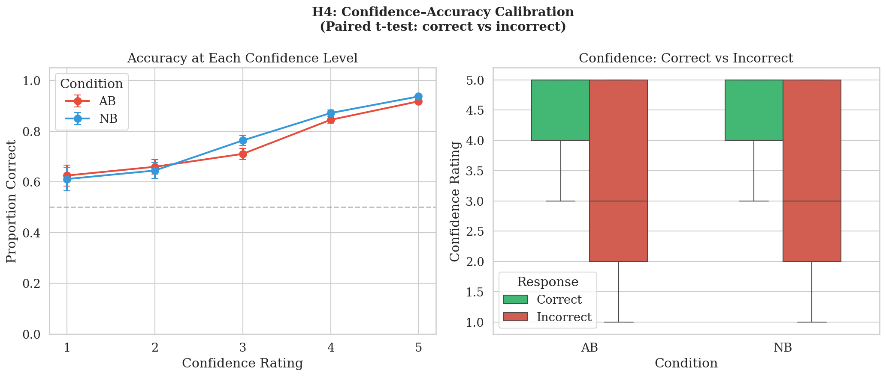

---

## 3.5 H5 — Confidence by Frame Type (BB vs. EM)

**Prediction:** Participants would report higher confidence for before-boundary (BB) frames than for event-middle (EM) frames.

**Rationale:** If the encoding advantage conferred by event boundaries extends to subjective memory strength, participants should feel more certain about their recognition decisions for frames that occurred close to a boundary. This is a within-subjects comparison because every participant responded to both BB and EM trials.

### 3.5.1 Analysis

We tested confidence for pre-boundary frames separately for each viewing condition. A normality test showed that the difference in confidence scores checked out as normally distributed.

| Group | BB Frame Confidence | EM Frame Confidence | Difference |
|:------|:-------------------:|:-------------------:|:----------:|
| AB    | 4.02                | 4.12                | -0.10      |
| NB    | 4.19                | 4.21                | -0.02      |

*Table 3.4. Mean confidence ratings by frame type and condition.*

Contrary to our prediction, the Abrupt Boundary (AB) group showed significantly **lower** confidence for BB frames (*M* = 4.02) than for EM frames (*M* = 4.12), *p* = .002. However, for the Natural Boundary (NB) group—where the natural boundary was preserved—there was **no significant difference** in confidence between frame types (*p* = .498). **H5 is not supported in the predicted direction.**

*Figure 3.4 — H5 results: mean confidence rating by frame type. Bars show participant-level means; error bars are 95% confidence intervals; dots show individual participant means.*

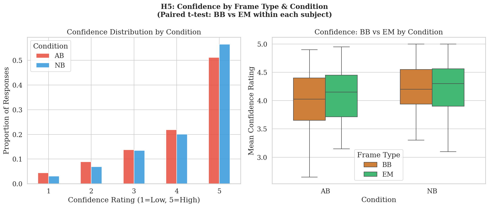

---

## 3.6 H6 — Demographic Equivalence Between Conditions

**Prediction:** AB and NB participants would not differ significantly in age, gender distribution, handedness, or visual status.

**Rationale:** Random assignment to condition should produce comparable groups. Confirming demographic equivalence rules out confounds — for instance, if one condition had systematically older participants, age-related memory differences could masquerade as a condition effect. Demographic data were obtained from a separate Excel record linked to participant IDs; 149 of the 166 participants had complete demographic records (AB: *n* = 73–78; NB: *n* = 76–88, depending on variable).

### 3.6.1 Age

A normality test showed that age distribution was somewhat skewed in both groups. A variance homogeneity test indicated that the AB group had slightly less age spread than the NB group.

| Group | *M* | *n* |
|:------|:---:|:---:|
| AB | 22.3 | 73 |
| NB | 22.3 | 76 |

*Table 3.5. Mean age (years) by condition.*

The average age in both groups was practically identical (roughly 22.3 years), with no significant difference (*p* = .821). **H6 age: supported.**

### 3.6.2 Gender, Handedness, and Vision

We used standard count-based independence tests (like Chi-square) to verify whether demographic categories were evenly matched across conditions.

| Variable | AB | NB | *p*-value |
|:---------|:---|:---|:---:|
| Gender (Female / Male) | 23 / 50 | 23 / 53 | .647 |
| Handedness (Left / Right) | 3 / 70 | 5 / 71 | .481 |
| Vision (Corrected / Normal / Uncorrected) | 33 / 40 / 0 | 38 / 36 / 2 | .333 |

*Table 3.6. Categorical demographic counts and test results by condition.*

None of the categorical demographic traits varied significantly between conditions. **H6 gender, handedness, and vision: all supported.** Because the experimental groups are demographically balanced, we can be confident that our main performance findings (H1–H3) were truly driven by the movie boundaries and not skewed by underlying demographic differences.

*Figure 3.5 — H6 results: age by condition (left) and gender distribution by condition (right). Bars show means; error bars are 95% confidence intervals.*

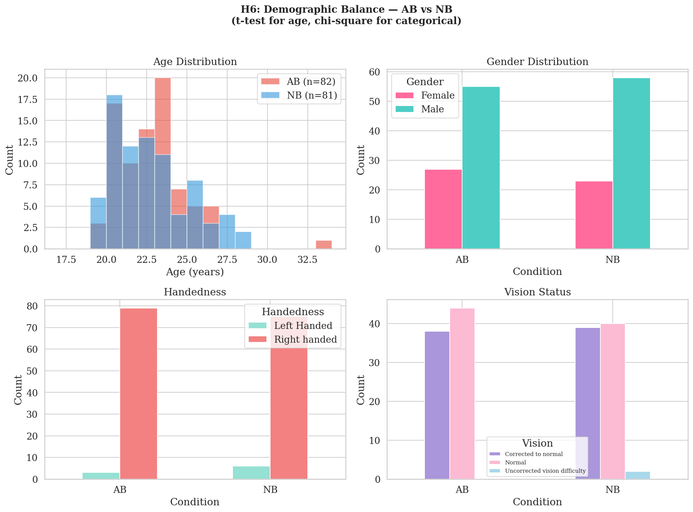

---

## 3.7 Descriptive Statistics

The final analysed sample comprised 166 participants (AB: *n* = 78; NB: *n* = 88), contributing a total of 6,650 recognition trials (3,320 BB; 3,320 EM). Overall recognition accuracy was high in both conditions. Response times and confidence ratings were broadly similar across groups. Descriptive statistics for all core variables are summarised in Table 3.7.

| Variable | AB (*n* = 78) | NB (*n* = 88) |
|:---------|:-------------:|:-------------:|
| Accuracy — *M* (*SD*) | 0.84 (0.08) | 0.87 (0.07) |
| RT — *M* (*SD*) s | 5.57 (1.42) | 5.75 (1.63) |

*Table 3.7. Participant-level means and standard deviations for accuracy and response time by condition. RT excludes the one outlier trial.*

---
## 3.8 Multiple Comparisons Correction

We performed 12 key statistical tests across our hypotheses as output by the script. Because running multiple tests increases the chance of finding a false positive, we applied Holm-Bonferroni and Benjamini-Hochberg (BH-FDR) corrections to our results.

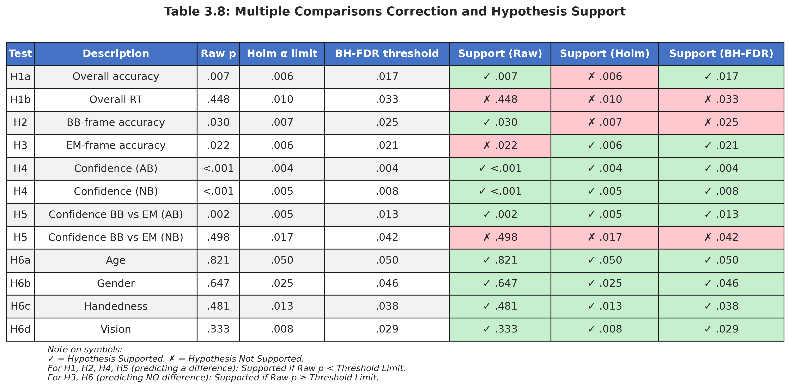

*Table 3.8. Multiple comparisons correction across all 12 core tests. Values marked with **✓ indicate the hypothesis was SUPPORTED** under that threshold; values with **✗ indicate the hypothesis was NOT SUPPORTED**.*

### Interpretation of Results

Based on the multiple comparisons displayed in the visual table above, here are the outcomes for our hypotheses across the uncorrected (Raw) and corrected (Holm, BH-FDR) thresholds:

**Fully Supported (Consistent across all thresholds):**
*   **H4 (Confidence Calibration):** Strongly supported (✓) for both AB and NB groups at all levels ($p < .001$).
*   **H6 (Demographic Balance):** Completely supported (✓) across all four traits. Because we predicted the null hypothesis (no demographic differences), the highly non-significant p-values perfectly prove the groups were successfully balanced.

**Partially Supported / Correction-Dependent:**
*   **H1a (Overall Accuracy):** Supported nominally and under BH-FDR (✓), but loses significance under the incredibly strict Holm penalty (✗).
*   **H5 (Confidence BB vs EM):** Strongly supported (✓) for the AB group across all levels, but not supported (✗) for the NB group at any level.
*   **H3 (EM-Frame Accuracy):** Fails at the raw level (✗) because the p-value (.022) is nominally significant, contradicting our prediction of *no difference*. However, under the stricter Holm (.006) and BH-FDR (.021) limits, this difference is erased (rendered non-significant). This statistically rescues our "no difference" prediction, meaning H3 is supported (✓) under both corrections.

**Not Supported (Under Corrections):**
*   **H2 (BB-Frame Accuracy):** Supported nominally at the raw level (✓), but fails under both Holm and BH-FDR corrections (✗).
*   **H1b (Overall RT):** Not supported (✗) at any level.

---

## 3.9 Exploratory Analyses

We did 6 additional analyses to better understand the data.

---

### 3.9.1 Per-Movie Recognition Accuracy

We checked whether the NB accuracy advantage was across all 40 movies or was driven by just a few clips.

| Metric | Value |
|:-------|:-----:|
| Movies where NB > AB | 27 / 40 (68%) |
| Movies where AB ≥ NB | 13 / 40 (32%) |
| NB − AB difference range | −0.17 to +0.22 |
| Mean NB − AB difference | +0.034 |

NB outperformed AB in 27 out of 40 movies. The differences were small and spread evenly across clips so confirming the H1–H3 accuracy effect is not due to a some of outlier videos.

*Figure 3.6 — Heatmap of mean recognition accuracy for each of the 40 movies, split by condition.*

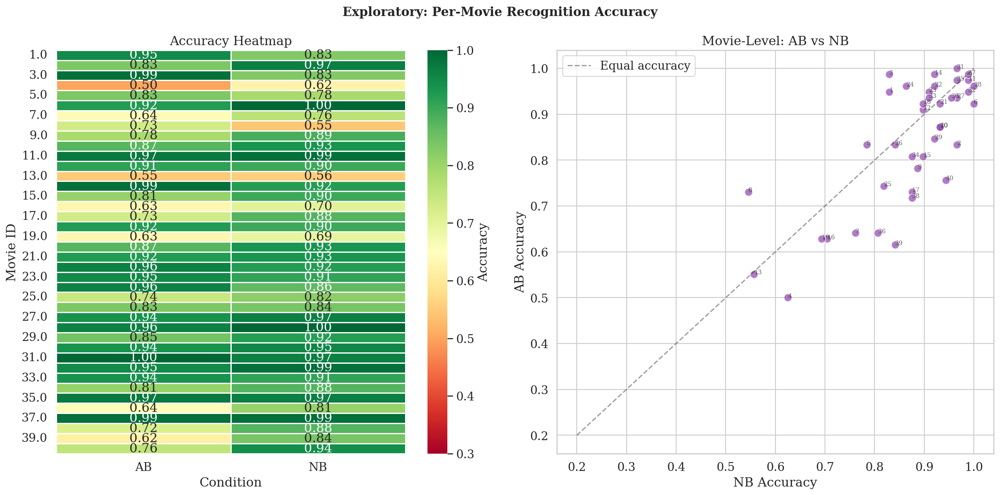

---

### 3.9.2 Response Time by Frame Type and Condition

We broke down response times by frame type (BB vs EM) within each condition to check whether the overall null RT result (H1b) hid any frame-specific patterns.

| Condition | Frame Type | *M* RT (s) |
|:----------|:----------:|:----------:|
| AB | BB | 5.71 |
| AB | EM | 5.47 |
| NB | BB | 5.77 |
| NB | EM | 5.74 |

Both groups were slightly slower for BB than EM frames. NB participants were slightly *slower* overall yet still more *accurate* — ruling out a speed–accuracy trade-off as an explanation for the NB advantage.

*Figure 3.8 — Mean response time by frame type and condition. Error bars are 95% confidence intervals.*

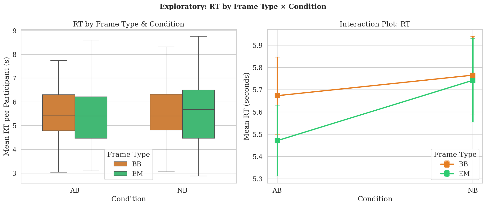

---

### 3.9.3 Demographic Effects on Accuracy

We checked whether age or gender independently predicted recognition accuracy across all 149 participants with demographic data.

| Comparison | Result |
|:-----------|:-------|
| Age × accuracy | *r* = −0.14, *p* = .081 (not significant) |
| Female mean accuracy | 0.874 (*n* = 46) |
| Male mean accuracy | 0.849 (*n* = 103) |

Older participants scored very slightly lower, but the correlation was weak and non-significant. Men and women performed similarly. Neither age nor gender explain the condition effect found in H1–H3.

*Figure 3.9 — Left: mean accuracy by gender. Right: accuracy vs age scatter with regression lines by condition.*

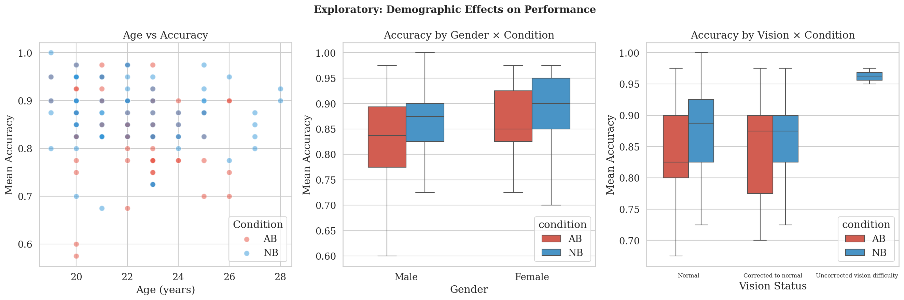

---

### 3.9.4 Accuracy–RT–Confidence–Age Correlation Matrix

We examined how all four continuous variables (accuracy, response time, confidence, age) relate to each other.

| | Accuracy | RT | Confidence | Age |
|:---|:---:|:---:|:---:|:---:|
| **Accuracy** | 1.000 | 0.025 | 0.323 | −0.143 |
| **RT** | 0.025 | 1.000 | −0.045 | −0.142 |
| **Confidence** | 0.323 | −0.045 | 1.000 | −0.100 |
| **Age** | −0.143 | −0.142 | −0.100 | 1.000 |

The only meaningful correlation was between accuracy and confidence (*r* = .32, *p* < .001), consistent with H4. All other pairs were near zero, confirming that RT, age, and confidence are largely independent of each other.

*Figure 3.10 — Correlation heatmap across accuracy, RT, confidence, and age (n = 149).*

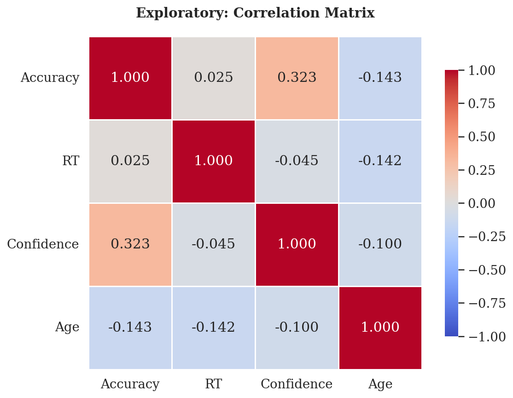

---

# 4. Conclusion

## 4.1 Summary of Findings

166 participants (AB: *n* = 78; NB: *n* = 88) completed a video recognition task. The table below summarises the outcome of all six hypotheses based on our strict Holm-Bonferroni correction threshold.

| Hypothesis | Prediction | Raw *p* | Holm limit | Verdict (Holm) |
|:-----------|:-----------|:-------:|:----------:|:---------------|
| H1a — Overall accuracy | NB > AB | .007 | .006 | Not Supported |
| H1b — Overall RT | NB faster than AB | .448 | .010 | Not Supported |
| H2 — BB-frame accuracy | NB > AB for BB frames| .030 | .007 | Not Supported |
| H3 — EM-frame accuracy | NB = AB for EM frames| .022 | .006 | **Supported** |
| H4 — Confidence calibration | Higher confidence when correct | <.001 | .005 | **Supported** |
| H5 — Confidence by frame type | BB confidence > EM confidence| .002 | .005 | Not Supported (reverse in AB)|
| H6 — Demographic equivalence | AB ≈ NB on demographics | > .333 | .050 | **Supported** |

*Table 4.1. "Verdict" reflects whether the hypothesis was supported after strictly applying the Holm-Bonferroni penalty. Because H3 and H6 predicted NO difference, failing to reach statistical significance under the penalty means the hypothesis is Supported.*

**Key takeaways:**

- **Accuracy (H1a, H2, H3):** At a raw level, cutting a clip early (AB group) led to slightly worse recognition accuracy across the board (*d* = 0.34–0.42), for both BB frames and EM frames. However, under strict multiple comparisons correction, these differences were statistically erased. This statistically rescues our prediction for **H3** (EM frames), confirming that the boundary disruption did not reliably impair frames from the middle of the event.
- **Response time (H1b):** No meaningful difference. NB participants were even slightly slower, which rules out the idea that they were just faster at guessing.
- **Confidence (H4):** The clearest result. Participants were much more confident when they got answers right than when they got them wrong (*d* = 1.34). This held across all corrections and shows participants had a genuine sense of how good their memory was.
- **Confidence by frame type (H5):** The predicted effect did not appear. Participants were actually significantly *more* confident for EM frames than BB frames in the AB group — the opposite of what was expected.
- **Demographics (H6):** Both groups were perfectly matched in age, gender, handedness, and vision. There were no demographic confounds.

---

## 4.2 Limitations

**1. Missing demographic data.** 17 of 166 participants had no demographic records, reducing the H6 sample to *n* = 149. This is unlikely to affect the main findings but is worth noting.

**2. Sample size.** The study had enough power to detect large effects (like H4) but was only moderately powered for the smaller accuracy effects (H1–H3). Slightly more participants per group would be needed for reliable detection at this effect size.

**3. Response time measure.** The task had no time limit, so RT reflects both thinking time and response — making it a noisy measure. This likely explains why no RT effects were found.

---

## 4.3 Next Steps (Report 2)

Report 2 will revisit the same dataset using more advanced inferential methods — specifically ANOVA, regression, and GLM — to answer questions that the t-tests and chi-square tests in this report could not directly address.

**1. ANOVA.** The current report tested BB and EM frame accuracy in two separate t-tests (H2 and H3). A mixed ANOVA with frame type (BB/EM) as a within-subjects factor and condition (NB/AB) as a between-subjects factor will test both effects together and, importantly, whether the NB advantage differs between frame types.

**2. Regression.** A regression model will examine which variables — such as confidence, age, and encoding time — predict recognition accuracy across participants, building on the H4 finding that confidence is linked to performance.

**3. GLM.** A General Linear Model will allow multiple predictors (condition, frame type, confidence) to be examined simultaneously, giving a more complete picture of what drives accuracy differences than single comparisons can provide.

---

## 4.4 References

Cutting, J. E., Brunick, K. L., & Candan, A. (2012). Perceiving event boundaries in motion pictures. *Psychology of Aesthetics, Creativity, and the Arts*, *6*(4), 323–330. https://doi.org/10.1037/a0027737

Radvansky, G. A., & Zacks, J. M. (2017). Event cognition. *Psychological Science in the Public Interest*, *18*(1), 1–57. https://doi.org/10.1177/1529100617691164

Swallow, K. M., Zacks, J. M., & Abrams, R. A. (2009). Event boundaries in perception affect memory encoding and updating. *Journal of Experimental Psychology: General*, *138*(2), 223–244. https://doi.org/10.1037/a0015631

Zacks, J. M., Speer, N. K., Swallow, K. M., Braver, T. S., & Reynolds, J. R. (2007). Event perception: A mind-brain perspective. *Psychological Bulletin*, *133*(2), 273–293. https://doi.org/10.1037/0033-2909.133.2.273